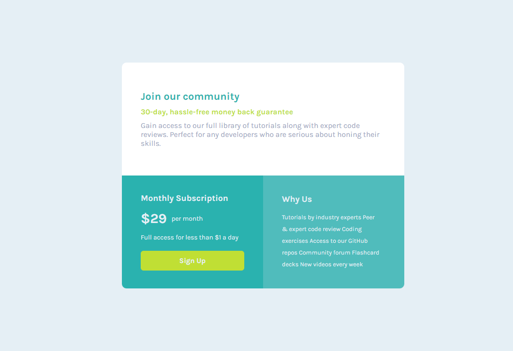

# Frontend Mentor - Single price grid component

## Table of contents

- [Overview](#overview)
  - [The challenge](#the-challenge)
  - [Screenshot](#screenshot)
  - [Links](#links)
- [My process](#my-process)
  - [Built with](#built-with)
- [Author](#author)

## Overview

### The challenge

Users should be able to:

- View the optimal layout depending on their device's screen size

### Screenshot

### Links

- Live Site URL: [Stats Preview](https://single-price-ag171980.netlify.app/)

## My process

### Built with

- Semantic HTML5 markup
- CSS custom properties
- Flexbox

## Author

- Website - [Nicolas](https://portfolionicolas.netlify.app/)
- Frontend Mentor - [@ag171980](https://www.frontendmentor.io/profile/ag171980)